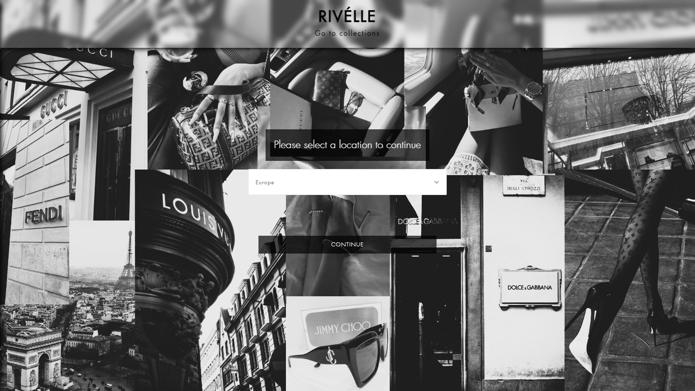
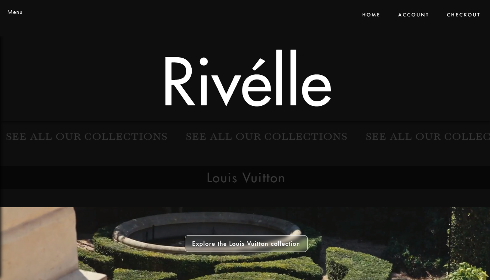
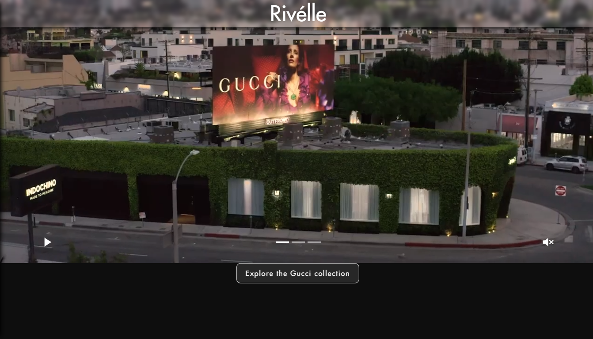
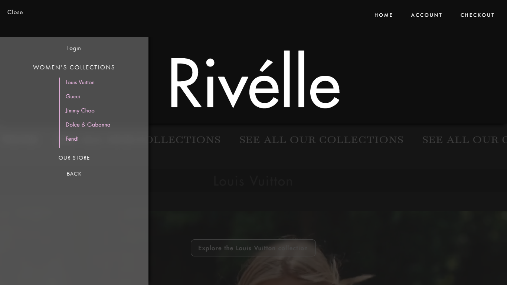

<h1 align="center">Hi 👋, I'm Bárbara Lucía Senra</h1>
<h3 align="center">A passionate Full Stack developer from Argentina to 🌎</h3>

 🔭 My last big project was [RIVELLE](https://rivelle.netlify.app/)

 🌱 I’m currently an Industrial Engineering student.

 👨‍💻 All of my projects are available at [https://github.com/barbilusenra](https://github.com/barbilusenra)

 📫 How to reach me **barbaraluciasenra@gmail.com**

<h3 align="left">Connect with me:</h3>

<h3 align='left'>Rivelle proyect:</h3>

  
   
  
  
   

<h3 align="left">Languages and Tools:</h3>

 
 
 
  
 
 
 
 
 
 

